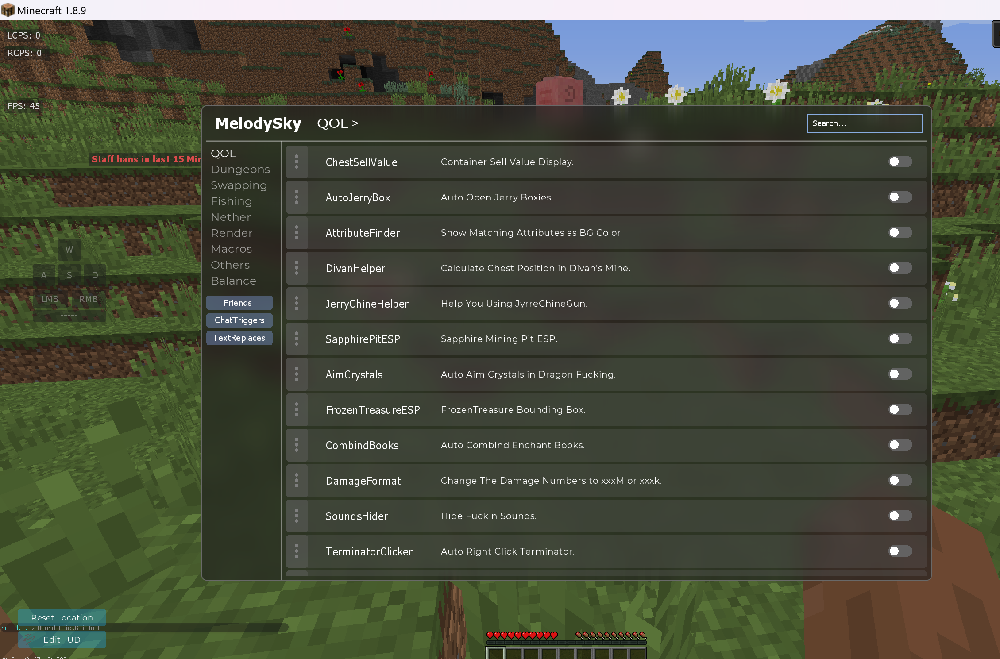
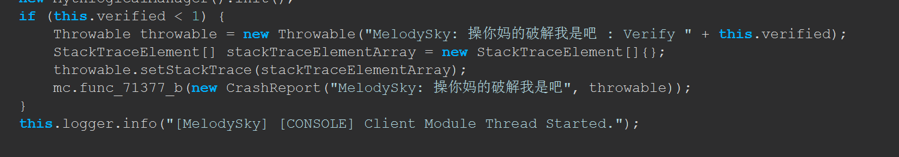
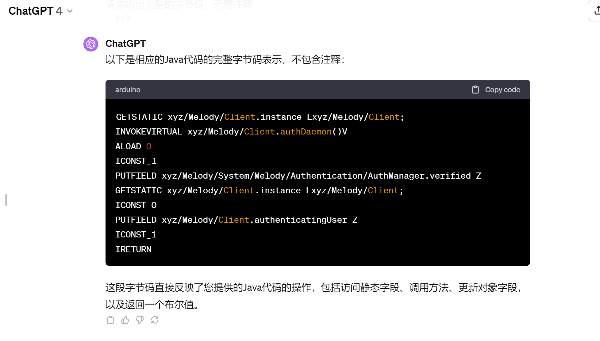

# MelodySky
MelodySky 2.10.5 Cracked &amp; deobf jar &amp; origin jar &amp; source code


# How to crack?
Find: xyz/Melody/System/Melody/Authentication/AuthManager.class
Replace Bytecode for "authMe":
```
GETSTATIC xyz/Melody/Client.instance Lxyz/Melody/Client;
INVOKEVIRTUAL xyz/Melody/Client.authDaemon()V
ALOAD 0
ICONST_1
PUTFIELD xyz/Melody/System/Melody/Authentication/AuthManager.verified Z
GETSTATIC xyz/Melody/Client.instance Lxyz/Melody/Client;
ICONST_0
PUTFIELD xyz/Melody/Client.authenticatingUser Z
ICONST_1
IRETURN
```
Then, enjoy.

Nice client with nice obfuscator
and IRC has no secondary authentication
shit code.


# Funny


# ChatGPT Moment



